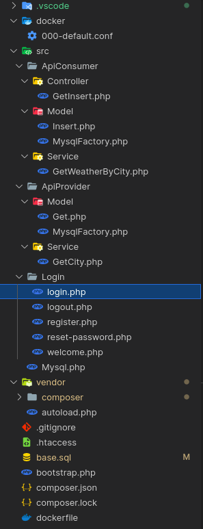
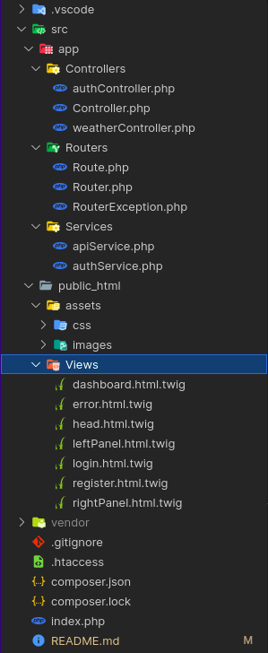
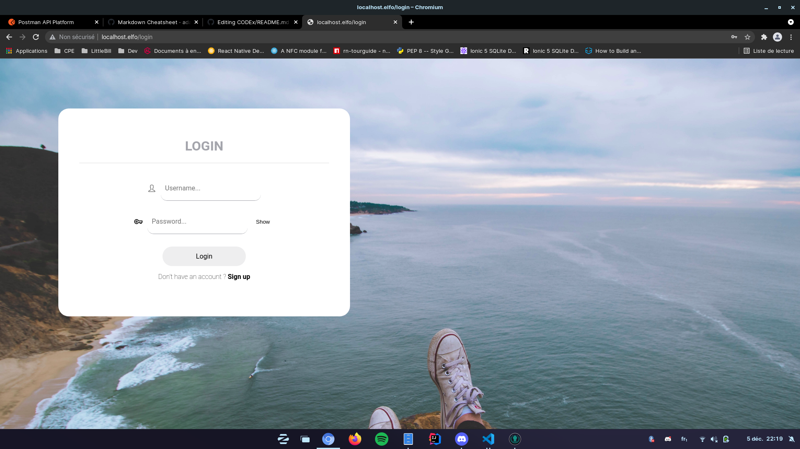
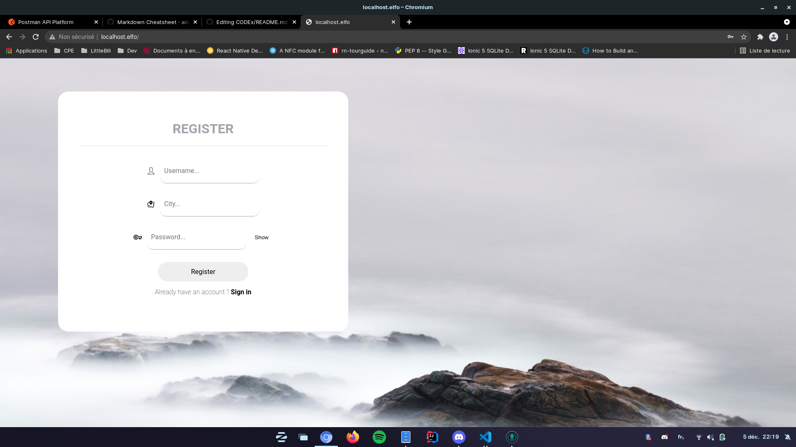
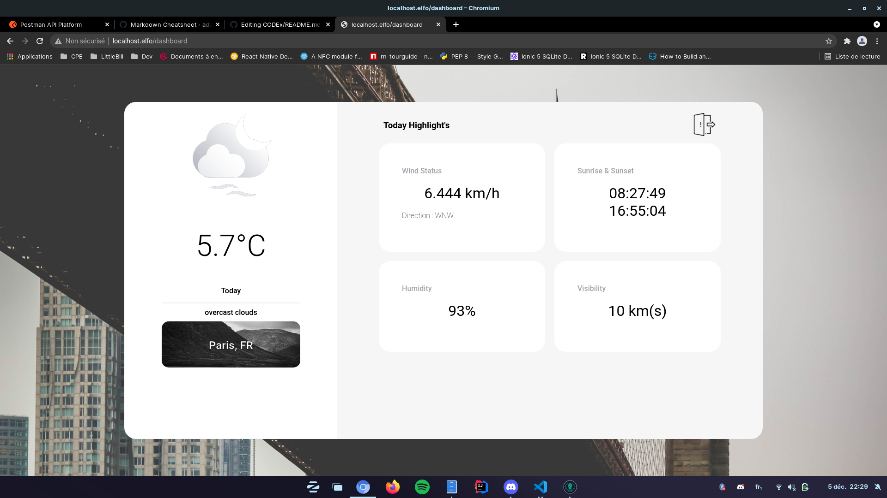

# Projet Web

- Par
- ### [DUVEAU Pierre](https://github.com/PierroD)
- et
- ### [EPINAT Térence](https://github.com/Terence-69)

# SOMMAIRE :

## Choix techniques :

On a décidé de séparer le projet en 2 parties distinctes :

- une API (Back-end) avec authentification et alimentation de la base de données
- une application web (Front-end) traite et affiche les données reçus par l'API

## Les défis techniques :

La solution :

> Le but de cette architecture est de se rapprocher le plus possible d'une architecture qu'un développeur est à même de rencontrer sur le monde du travail.

Pour le Front-end :

> Le défis le plus important pour la partie Front-end a été de tout faire `from scratch`, c'est à dire qu'aucun framework ni template CSS / JS / PHP n'a été utilisé.
>
> La seule liberté fut le moteur de template (Twig) qui était autorisé dans les consignes.

Pour l'API :

> Les données transites via le fonctionnement d'une API RestFull, ne pouvant créer de multiples fonctionnalités dû notamment à la durée des scéances de TP. On a tout de même pu créer :
>
> - Create
> - Read
> - Update
>
> De la méthodologie CRUD.

## Les défis personnels :

**L'API :**

> La personne qui c'est chargé de la partie API, était celle la moins à l'aise avec la notion d'API, c'est un choix volontaire de notre part afin de permettre à cette personne de progressé en profitant du projet pour voir, comprendre et élaborer de nouvelles solutions.
>
> Il lui a donc fallu comprendre ses enjeux, et apprendre à surmonter certaines difficultés, comme comprendre comment récupérer des données ou bien quelles sont les formalités de retours d'une API RestFull.

**Le Front-end**

> La personne qui fut en charge de cette partie du projet, quant à elle, n'était pas très à l'aise le CSS / JS sans framework, son défit a alors été d'approfondir ses connaissances dans ces différentes technologies, ainsi que de mettre en pratiques les différentes bonnes pratiques qui découlent de ces technologies.

## Les outils utilisés :

- IDE : VsCode
- Back-end : PHP (Composer & Doctrine)
- Front-end : PHP / JS / CSS (Twig)
- BDD : MySQL
- API externe : [OpenWeather](https://openweathermap.org/current)
- Requêtes HTTP : [Postman](https://www.postman.com/)

## Architectures :

<details>
<summary>Images</summary>
<p>Backend</p>

<p>Frontend</p>

</details>

## Photos de la solution Web :

<details>
<summary>Images</summary>
<p>Login</p>

<p>Register</p>

<p>Dashboard</p>

</details>

##  Liens des projets :

- [Front-end](https://github.com/PierroD/projet_web_front)
- [Back-end](https://github.com/Terence-69/ProjetWeb)

## Installation :

1. Installer le Back-end
2. Création de la BDD
3. Installer le Front-end
4. Démarrer le projet

### 1°) Installer le Back-end

- Téléchargez le projet sur le lien suivant : [Télécharger](https://github.com/Terence-69/ProjetWeb)
- Mettre le contenu dans le dossier de votre choix
- Installer Composer : [Tutoriel](https://linuxize.com/post/how-to-install-and-use-composer-on-ubuntu-18-04/)
- Faire la commande suivante : `composer install`
- Faire la commande suivante : `composer dump-autoload`

### 2°) Création de la BDD

- Installez MySQLI : `sudo apt-get install -y php-mysqli`
- Rentrez dans MySQL : `sudo mysql`
- Copiez | Collez le contenu du script : `base.sql`

### 3°) Installer le Front-end

- Téléchargez le projet sur le lien suivant : [Télécharger](https://github.com/PierroD/projet_web_front)
- Mettre le contenu du repos dans le dossier du Vhost de votre choix
- Faire la commande suivante : `composer install`
- Faire la commande suivante : `composer dump-autoload`
- Le front utilise de la ré-écriture d'URL (vérifiez que ce paramètre est activé dans votre Vhost)
```
  <VirtualHost *:80>

    ServerAdmin admin@localhost.elfo
    ServerName localhost.elfo
    ServerAlias www.localhost.elfo
    DocumentRoot /var/www/localhost.elfo/public_html


    ErrorLog ${APACHE_LOG_DIR}/error.log
    CustomLog ${APACHE_LOG_DIR}/access.log combined
</VirtualHost>

<Directory /var/www/localhost.elfo/public_html>
    Options Indexes FollowSymLinks
    AllowOverride All
    Require all granted
</Directory>
```

### 4°) Démarrer le projet 

- A la racine du projet Back-end dans un terminal, écrire la commande suivante : `php -S 127.0.0.1:8000`
- Se rendre sur l'adresse de votre Vhost
- Enjoy :smiley: